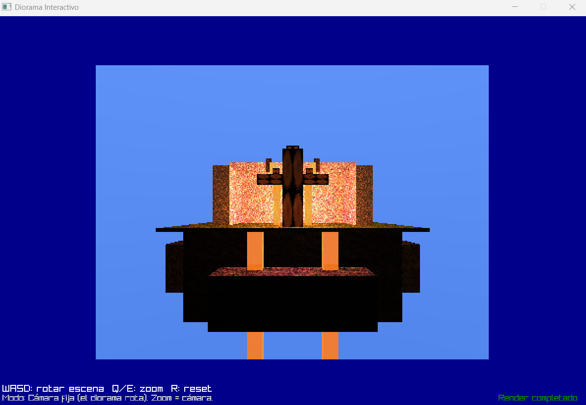

# Diorama Interactivo con Ray Tracing

Este proyecto es un diorama interactivo renderizado en tiempo real utilizando técnicas de ray tracing. La escena está compuesta por múltiples cubos texturizados que forman una isla con componentes como un portal, flujos de lava, agua y elementos naturales. Implementa efectos avanzados como reflexión, refracción, iluminación Phong y un skybox dinámico.

## Características

- **Renderizado por ray tracing** con reflexión y refracción.
- **Texturas personalizadas** para materiales como piedra, musgo, agua, lava, madera y portal.
- **Iluminación Phong** con múltiples fuentes de luz y materiales emisivos.
- **Skybox gradient** que simula un cielo dinámico.
- **Cámara orbital** con capacidad de zoom y rotación de la escena.
- **Interfaz interactiva** usando Raylib para control en tiempo real.

## Cómo Ejecutar

### Requisitos
- Rust y Cargo instalados.
- Dependencias: `glam`, `image`, `raylib` en el archivo `Cargo.toml`.

### Pasos

1. Ejecuta el proyecto:
   ```bash
   cargo run
   ```
3. Controles:
   - **W/S/A/D**: Rotar la escena.
   - **Q/E**: Acercar/alejar la cámara.
   - **R**: Resetear la cámara y rotación.

## Estructura del Proyecto

```
Proyecto2Graficas/
├── README.md
├── Cargo.toml
├── Cargo.lock
├── .gitignore
├── assets/
│   ├── flowers/
│   ├── lava/
│   ├── leaves/
│   ├── portal/
│   ├── stone/
│   │   ├── Rock12/
│   │   └── Rock41/
│   ├── stone_plants/
│   │   ├── Moss1/
│   │   ├── moss2/
│   │   └── Rock057/
│   ├── water/
│   └── wood/
│       ├── TreeEnd3/
│       └── Wood28/
└── src/
    ├── camera/
    │   ├── mod.rs
    │   └── orbit_camera.rs
    ├── geometry/
    │   ├── cube.rs
    │   ├── intersections.rs
    │   ├── mod.rs
    │   └── ray.rs
    ├── lighting/
    │   ├── mod.rs
    │   └── phong.rs
    ├── materials/
    │   ├── material.rs
    │   ├── mod.rs
    │   └── texture.rs
    ├── math/
    │   ├── matrix4.rs
    │   ├── mod.rs
    │   └── vector3.rs
    ├── scene/
    │   ├── mod.rs
    │   └── scene.rs
    ├── textures/
    │   ├── mod.rs
    │   └── skybox.rs
    ├── framebuffer.rs
    └── main.rs
```

## Dependencias

- **glam**: Librería matemática para gráficos, utilizada para operaciones vectoriales.
- **image**: Procesamiento de imágenes para cargar y manejar texturas.
- **raylib**: Librería multimedia para la creación de la interfaz gráfica y ventana de renderizado.

## Video del Diorama

<div align="center"> 
  <a href="https://uvggt-my.sharepoint.com/:v:/g/personal/dele23202_uvg_edu_gt/Efc9L67kdulHrYkY7Ssqz6oBHI9YBPax7uFzWuUJYHpzmw?e=ABeNwy&nav=eyJyZWZlcnJhbEluZm8iOnsicmVmZXJyYWxBcHAiOiJTdHJlYW1XZWJBcHAiLCJyZWZlcnJhbFZpZXciOiJTaGFyZURpYWxvZy1MaW5rIiwicmVmZXJyYWxBcHBQbGF0Zm9ybSI6IldlYiIsInJlZmVycmFsTW9kZSI6InZpZXcifX0%3D">  
  </a>
</div>


*Nota: solo tomar en cuenta que el video es largo por que me tardaba cuando se renderizaba, para eso, mejor ver en doble velocidad*

## Capturas de Pantalla

[](foto.png)


## Tecnologías Utilizadas

- **Lenguaje**: Rust
- **Librerías**: 
  - Raylib para la interfaz gráfica
  - Glam para operaciones matemáticas
  - Image para manejo de texturas
- **Técnicas**: Ray tracing, iluminación Phong, mapeo de texturas, reflexión, refracción.

## Autor

- Paula De León 
